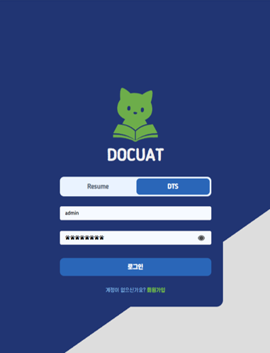
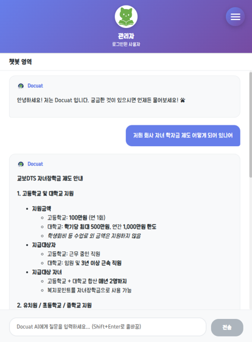
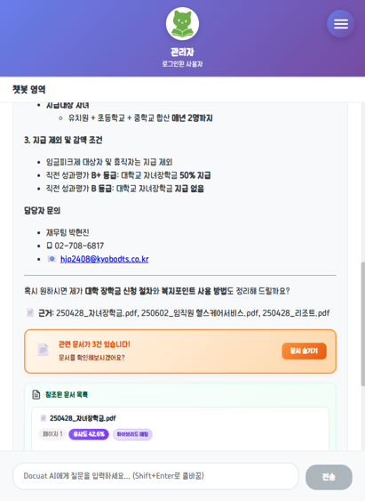
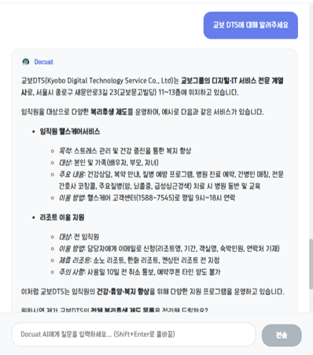
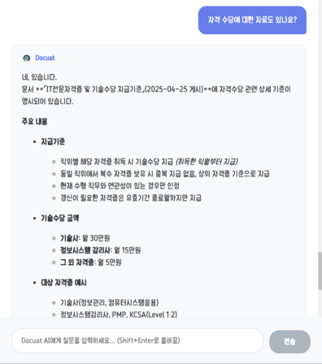
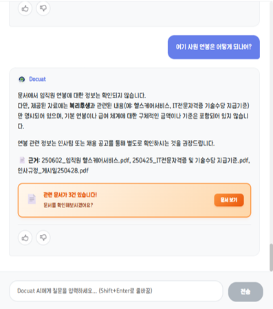
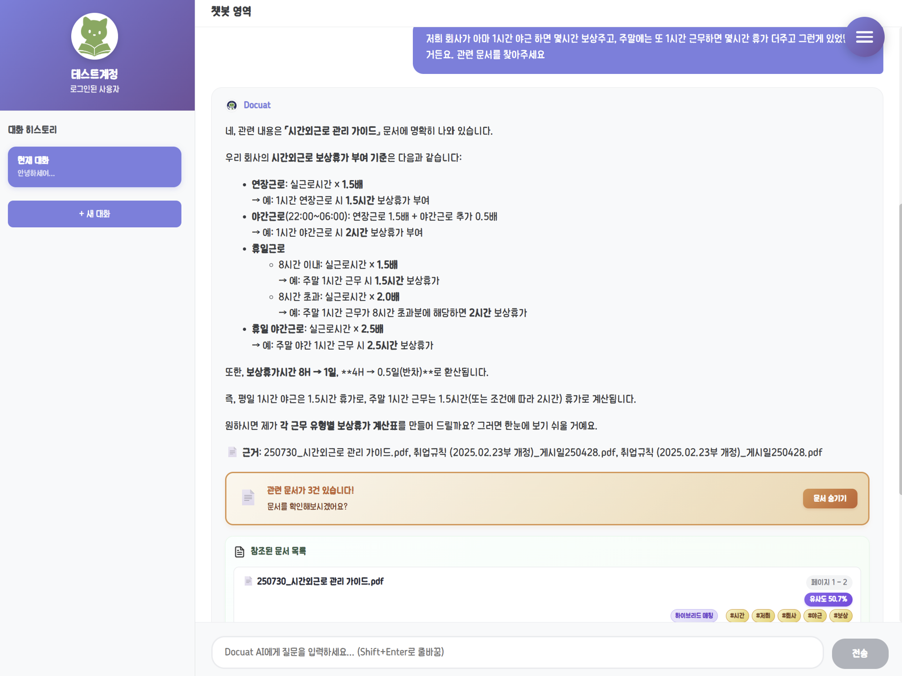
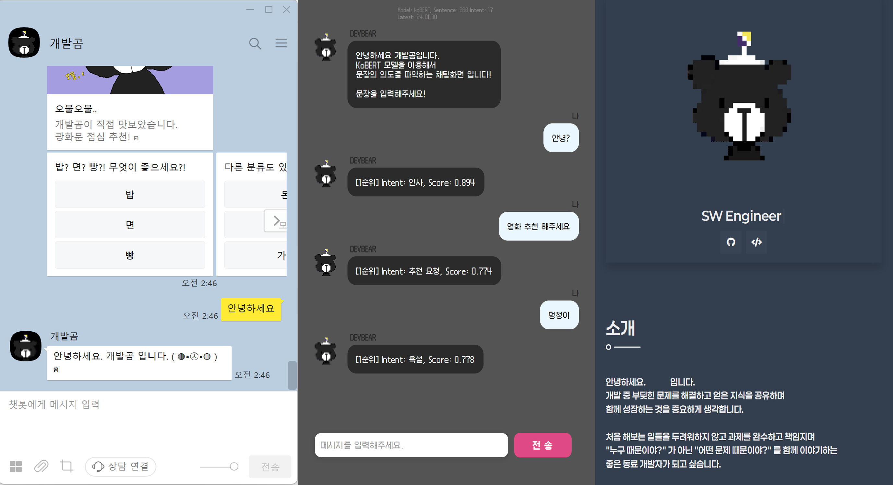

  <h1>UantumBear</h1>
  

    <b>SW Engineer</b>  
    <i>'u'ฅ </i>
  

  
  
  

 

---

# 🌠 Repository Overview

 

### 1.RAG 기반 챗봇 프로젝트
**Docuat** : 테스트 웹 서비스 / 사내 AI Agent 개발 경진대회 참가용 (사내 문서 기반 RAG 챗봇)

※ 사내 AI 경진대회 종료 및 퇴사로 인한 서비스 종료 

<kbd>Python</kbd> <kbd>FastAPI</kbd> <kbd>React</kbd> <kbd>Vite</kbd> / <kbd>Azure OpenAI</kbd> <kbd>Blob Storage</kbd> <kbd>PostgreSQL (pgvector)</kbd> / <kbd>GitHub Actions</kbd> <kbd>Azure</kbd>  

  
  
  

 

  
  
  

  

 

&nbsp; 
---  

### 2. 강화학습 기말 프로젝트 (Verbal RL 기반 RAG 시스템 프롬프트 자동 최적화)
**Reinfoce** : https://github.com/UantumBear/Reinforce  
https://uantumbear-a0czd9btgdgkhre9.koreacentral-01.azurewebsites.net/docuat/reinforce/rl001  

ver 1. 강화학습의 action, state, reward 를 모티브로 언어적 피드백을 부여하여 프롬프트를 최적화하는 컨셉.  
ver 2. TextGrad 프레임워크를 기반으로 논문을 재현하고, 언어적 피드백을 통한 프롬프트를 최적화하는 실험.

<code>Backend :</code> <kbd>Python</kbd> <kbd>Google&nbsp;Generative&nbsp;AI</kbd> <kbd>Azure&nbsp;OpenAI</kbd> <kbd>Huggingface</kbd> <kbd>DSPy</kbd> <kbd>TEXTGRAD</kbd>  
<code>Frontend:</code> <kbd>React</kbd> <kbd>Copilot</kbd>  

&nbsp; 
---  

  

### 3. 개발 연습
**DevBear** : 의도 분류 챗봇 / 웹 개발  
http://www.devbearbot.xyz/chat2  
http://www.devbearbot.xyz/resume/  

<kbd>Python</kbd> <kbd>Flask</kbd> <kbd>FastAPI</kbd> <kbd>koBERT&nbsp;Fine-tuning</kbd> 

  

&nbsp; 
---

  

### 4. Design and Technology 학부 과제

**Design** : 외주 디자인 / 영상 과제 / 졸업 전시회 인트로 영상 제작    
**ProcessingDev** : 프로세싱 과제 / 졸업 작품 / 교내 공모전   
**ArduinoDev** : 졸업 작품 

<kbd>Photoshop</kbd> <kbd>Motion5</kbd> <kbd>SAI&nbsp;Tool</kbd> / <kbd>Processing</kbd> <kbd>kinect</kbd> / <kbd>Arduino</kbd> 

&nbsp; 
---  

     

---

# 🏢 Work Experience

### Kyobo DTS: SW Engineer (2021.12 - 2026.07)
#### Kyobo Life Insurance | AI Service Development Team
##### **(3) Enterprise GPT Project (2024.01 - 2026.07):**
  - GPT 관리자 웹 구축/개발  
  - JIRA 연동 RAG 파이프라인 구축
   
 <kbd>Python</kbd> <kbd>FastAPI</kbd> <kbd>Azure</kbd> <kbd>Elasticsearch</kbd> <kbd>Postgres</kbd> <kbd>Git</kbd> <kbd>Docker</kbd> <kbd>Jira</kbd> <kbd>Bitbucket</kbd> <kbd>HTML</kbd> <kbd>JavaScript</kbd> <kbd>CSS</kbd> 
   
##### **(2) Chatbot System (2023 - 2024):**
  - AI발화분석모델 PoC: Fine-tuned KoBERT for intent classification
  - Kakao chatbot service 유지운영
    
 <kbd>Python</kbd> <kbd>Pytorch</kbd> <kbd>HuggingFace</kbd> <kbd>KoBERT Fine-tuning</kbd> <kbd>Linux</kbd> / <kbd>Java</kbd> <kbd>Spring Boot</kbd> <kbd>Oracle</kbd> 
    
##### **(1) MyData Platform (2022 - 2023):**
  - phase 2: 서비스해지, 탈퇴 개발 (MCI)
      
<kbd>Java</kbd> <kbd>Spring</kbd> <kbd>Oracle</kbd> 

&nbsp; 
---  

     

---

# 🏫 Education

- **Sogang Univ. Graduate School of AI·SW** (2024.02 - Present)
  - M.S. Candidate in **AI & Data Science**

&nbsp; 
---  

- **Pusan National University** (2013.03 - 2019.02)
  - B.S. in **Aerospace Engineering** & B.D. in **Design and Technology** (Double Major)

&nbsp; 
---  

---
 

  

   
<table align="center">
  <tr>
    <td align="center">
      
    </td>
    <td align="center">
      
    </td>
  </tr>
</table>

<!--

-->

### 

